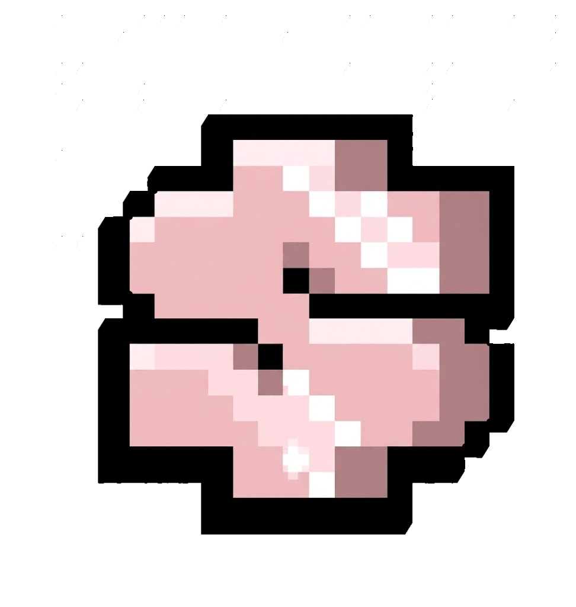
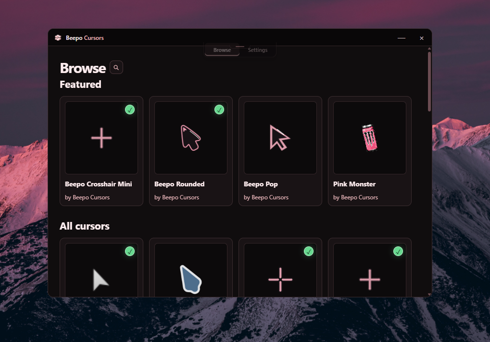

# Beepo Cursors

**A quiet place to find Windows cursor packs.**
**JOIN discord.gg/beep**
Browse cursor packs, preview every cursor state, apply with one click. 

## Features

- **Browse** — explore cursor families and variants with live previews of every cursor state
- **Apply** — activate a pack instantly, straight from the app or the website
- **Revert** — restore your default Windows cursors anytime
- **Website** — apply packs directly from [cursors.lie.red](https://cursors.lie.red) via the `beepocursors://` protocol

## Download

Grab the latest **installer** or **portable** build from [Releases](https://github.com/yfaj/beepocursors/releases/latest).

Requires Windows 10/11. The uninstaller's **Delete application data** option removes downloaded and imported packs.

*Beepo Cursors* · CC BY-NC-SA 4.0 — see [LICENSE](LICENSE)

